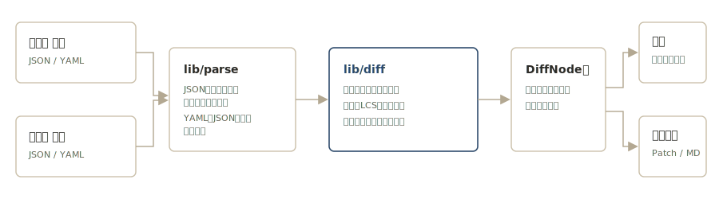

# semdiff

[](https://github.com/miruky/semdiff/actions/workflows/ci.yml)
[](https://www.typescriptlang.org/)
[](https://vitest.dev/)
[](https://opensource.org/licenses/MIT)

**JSONとYAMLをテキストの行ではなく値の構造として比較する意味的diffビューアです。キーの並び替えと整形の違いは差分にしません。**

## 概要

2つのドキュメントを貼ると、構造を再帰的に突き合わせて追加・削除・変更をパスつきで一覧します。行ベースのdiffと違い、キーの順序が入れ替わっても、インデントや改行が変わっても差分になりません。配列はLCS(最長共通部分列)で要素を対応付けるため、配列の途中に1件挿入しただけで後続すべてが「変更」と誤検出される行diffの典型的な問題が起きません。JSONはコメントと末尾カンマを許容し、YAMLにも対応するので、片側がJSON・片側がYAMLでも同じ土俵で比較できます。

動かす: https://miruky.github.io/semdiff/

### なぜ作ったのか

設定ファイルやAPIレスポンスの比較で行diffを使うと、フォーマッタの並び替えやインデント変更が大量の偽差分になり、本当の変更が埋もれます。「意味として何が変わったのか」だけを知りたい場面のための専用ビューアです。`package.json` のバージョン比較、IaCの状態ファイルの確認、APIの新旧レスポンスの突き合わせ、JSONとYAMLで書かれた同じ設定の照合を想定しています。

## 使い方

1. 変更前・変更後にJSONまたはYAMLを貼る(形式は自動判別。各入力の右上で明示指定もできる)。「サンプル」で動作を試せる
2. 構造diffに追加(緑)・削除(赤)・変更(黄)がパスつきで表示される。件数バッジで規模を把握する
3. 「パスで絞り込み」で該当パスだけに絞り、「変更なしを畳む」で差分に集中する。「すべて開く / 畳む」で木の開閉をまとめて切り替える
4. 「JSON Patch」でRFC 6902形式のパッチを、「Markdown」で変更の一覧表をクリップボードへ書き出す。「共有リンク」は入力ごとURLに符号化してコピーする(データはサーバーに送らない)
5. 右上で配色をライト / OS追従 / ダークに切り替えられる。入力はブラウザに自動保存される

### キーボードショートカット

| キー                        | 動作                     |
| :-------------------------- | :----------------------- |
| <kbd>Alt</kbd>+<kbd>S</kbd> | 変更前後を入れ替え       |
| <kbd>Alt</kbd>+<kbd>E</kbd> | サンプルを読み込む       |
| <kbd>Alt</kbd>+<kbd>U</kbd> | 変更なしの畳みを切り替え |
| <kbd>Alt</kbd>+<kbd>L</kbd> | 共有リンクをコピー       |
| <kbd>Alt</kbd>+<kbd>P</kbd> | JSON Patchをコピー       |
| <kbd>Alt</kbd>+<kbd>M</kbd> | Markdownをコピー         |
| <kbd>/</kbd>                | 絞り込みへフォーカス     |

### 差分の出かたの例

| 変更                        | 表示                                                     |
| :-------------------------- | :------------------------------------------------------- |
| `version` の値変更          | `~ version "1.4.0" → "2.0.0"`                            |
| `dependencies` にキー追加   | `+ dependencies.zod "^3.23.0"`                           |
| 配列 `tags` の途中に挿入    | 挿入された要素だけが `+ tags[1]`(後続は変更扱いされない) |
| 型の変化(配列→オブジェクト) | 中身を展開せず1件の変更として表示                        |

JSONはコメント(`//` と `/* */`)と末尾カンマを許容します。YAMLはJSON互換のスキーマで読むため、日付やタグなどJSONに無い型は対象外です。

## アーキテクチャ



入力は `lib/parse` がJSON(コメント・末尾カンマを許容)またはYAMLとして値に変換し、`lib/diff` が構造を突き合わせてDiffNode木を作ります。比較ロジックはDOMに依存しない純粋なモジュールで、深い等価判定、オブジェクトのキー集合の突き合わせ、配列のLCS対応付け、葉の変更だけを数える集計からなります。UIはDiffNode木を折りたたみ表示に写し、必要に応じてRFC 6902パッチやMarkdownへ書き出します。LCSは動的計画法のテーブルを `Uint32Array` 1本で持ち、要素の等価判定には深い比較を使っています。

## 技術スタック

| カテゴリ     | 技術                                                  |
| :----------- | :---------------------------------------------------- |
| 言語         | TypeScript 5(strict)                                  |
| 比較ロジック | 自前実装(実行時依存なし)                              |
| 入力解析     | JSON(コメント・末尾カンマ許容)・YAML(js-yaml)         |
| モーション   | GSAP(`prefers-reduced-motion` を尊重)                 |
| 書体         | Shippori Mincho / Zen Kaku Gothic New / IBM Plex Mono |
| ビルド       | Vite                                                  |
| テスト       | Vitest(37テスト)                                      |
| リンタ       | ESLint + Prettier                                     |
| CI / CD      | GitHub Actions                                        |
| 配信         | GitHub Pages                                          |

## プロジェクト構成

- `src/lib/diff.ts` — 深い等価判定、構造diff、配列のLCS対応付け、差分集計
- `src/lib/parse.ts` — JSON(コメント許容)とYAMLの解析・形式判別
- `src/lib/patch.ts` — RFC 6902 JSON Patchの生成と適用
- `src/lib/report.ts` — 差分のMarkdown書き出し
- `src/lib/share.ts` — 入力と表示設定のURL符号化
- `src/ui` — SVGアイコンと、reduced-motionを尊重するモーション
- `src/app.ts` — 入力の解析と折りたたみ木の組み立て、操作
- `docs` — アーキテクチャ図
- `.github/workflows` — CIとGitHub Pagesデプロイ

## はじめ方

### 前提条件

- Node.js 20以上

### セットアップ

```bash
git clone https://github.com/miruky/semdiff.git
cd semdiff
npm install
npm run dev
```

### テストの実行

```bash
npm test
```

### Lintの実行

```bash
npm run lint
```

### デプロイ

`main` ブランチへのプッシュでGitHub Actionsがビルドし、GitHub Pagesへ自動デプロイします。

## 設計方針

- **値として比較する** — パースしてから比べる。表記の揺れ(キー順序・空白・インデント・形式)は差分にしない
- **配列はLCSで対応付ける** — 途中への挿入・削除をそのものとして検出し、偽の変更連鎖を作らない
- **型が変わったら展開しない** — 配列がオブジェクトになったような変化は、中身の細かい差分より「型が変わった」事実の方が重要
- **送信ゼロ** — 比較はすべてブラウザ内。共有リンクも入力をURLへ符号化するだけで、サーバーには残さない
- **校正紙のような編集的トーン** — 箱と影を避け、罫線と余白で構造を示す。ライト/ダーク両対応で、動きは `prefers-reduced-motion` で止まる

## ライセンス

[MIT](LICENSE)
